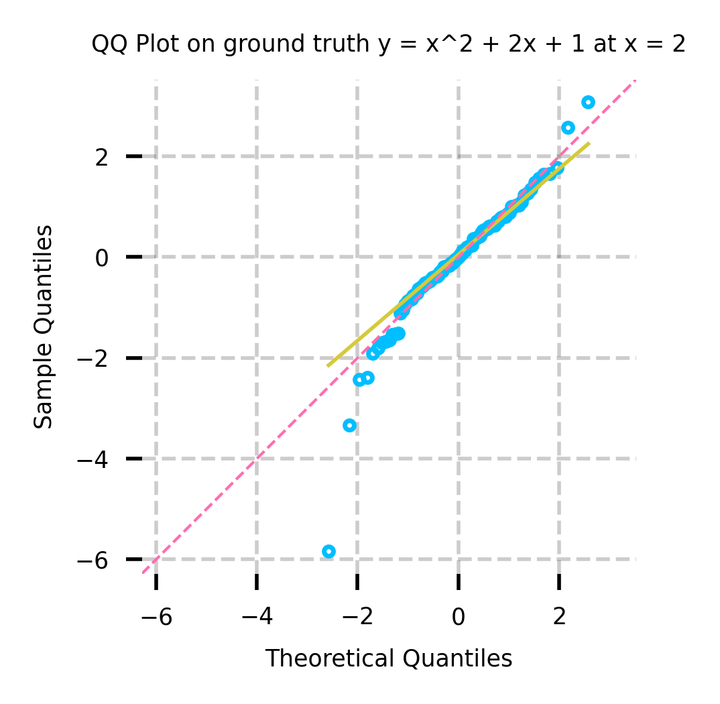
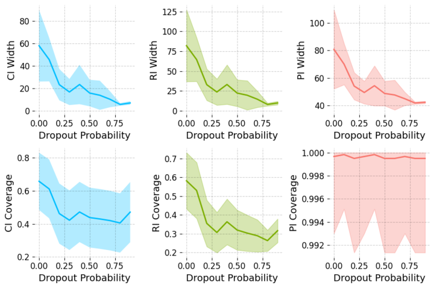
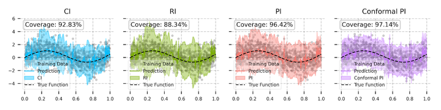
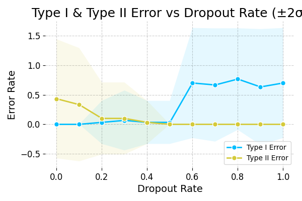
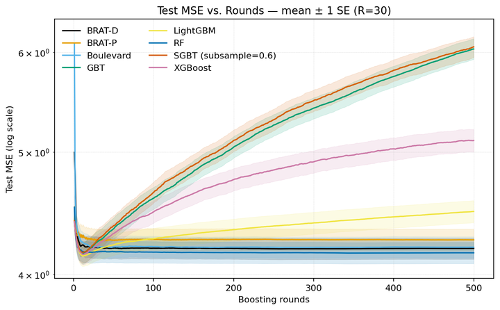

# Rebuttal for *Statistical Inference for Gradient Boosting Regression*

Dear Area Chair:

Thank you so much for handling our submission and communicating with the reviewers for their reviews! Last minute submission guidelines have restricted us from submitting any kind of images for rebuttal. We replace the plots with tables in the rebuttal accordingly. However, we still created all the plots that the reviewers asked for, and leave them with you here. We would greatly appreciate it if you can help with sending this over to the reviewers so that they can verify the visual results they want. Again, many thanks!

## QQ Plot

Reviewer kHmv,  question 2 requested a QQ plot to diagnose normality:

This plot can be accessed at `./experiments/qq_plot.ipynb`

## Interval Estimations v.s. Dropout Probability

Reviewer AVWH asks about the width of confidence intervals and dropout probability:

This plot can be accesed at `./jobs/coverage_rate.ipynb`

We have also included a version of Figure 1 with p = 0:

This can be generated by running `./experiments/1d_intervals.ipynb`

## Type I and Type II error v.s. Dropout Probability

Reviewer AVWH asks about the size and power of variable importance tests as a function of dropout:

This plot is generated using `./jobs/size_power_dr.py` and then `./plotting/size_pow_dr_plot.py`.

## Stopping time and MSE

Reviewer cjXq asked about stopping times and we produced the following graph to demonstrate that BRAT-D and BRAT-P do not overfit. 

This plot can be accessed at `./experiments/mse_comparison.ipynb`

## Replotting UCI MSE

We made the DPI of the plots higher for better resolution. We will provide the table with detailed performance statistics in the appendix for revised version. 

The source code for the tuning and training and plotting is available at `./experiments/optuna_mse.ipynb`

.png)

.png)

